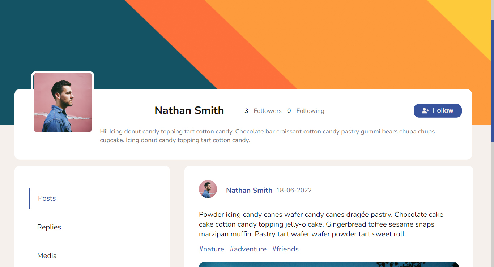
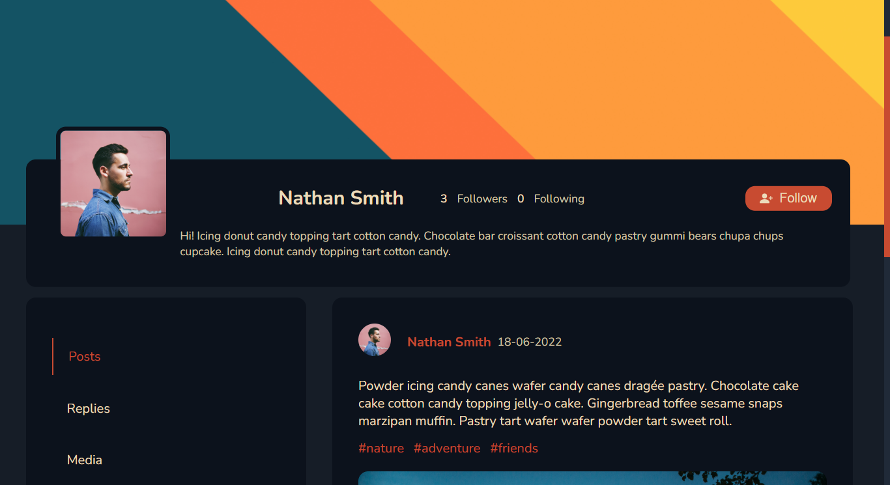
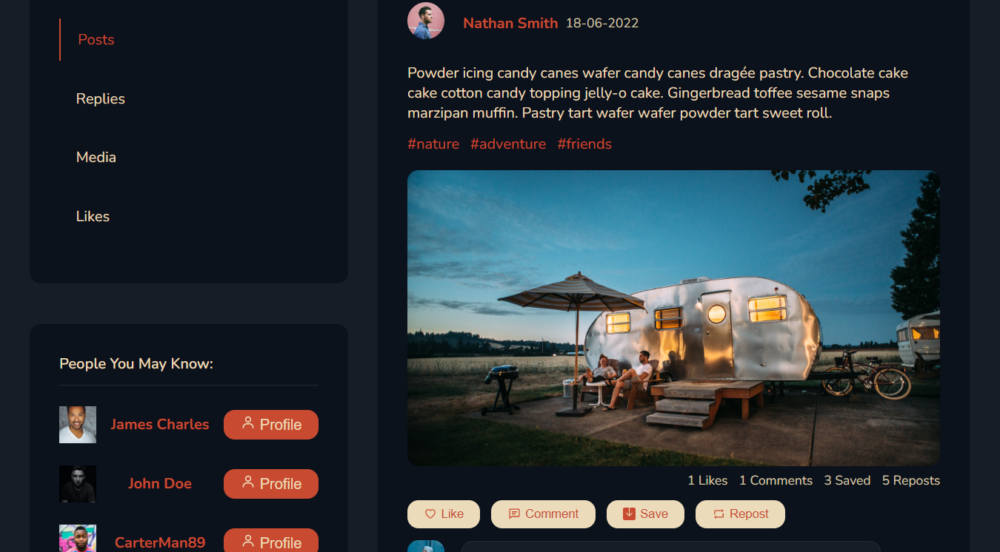
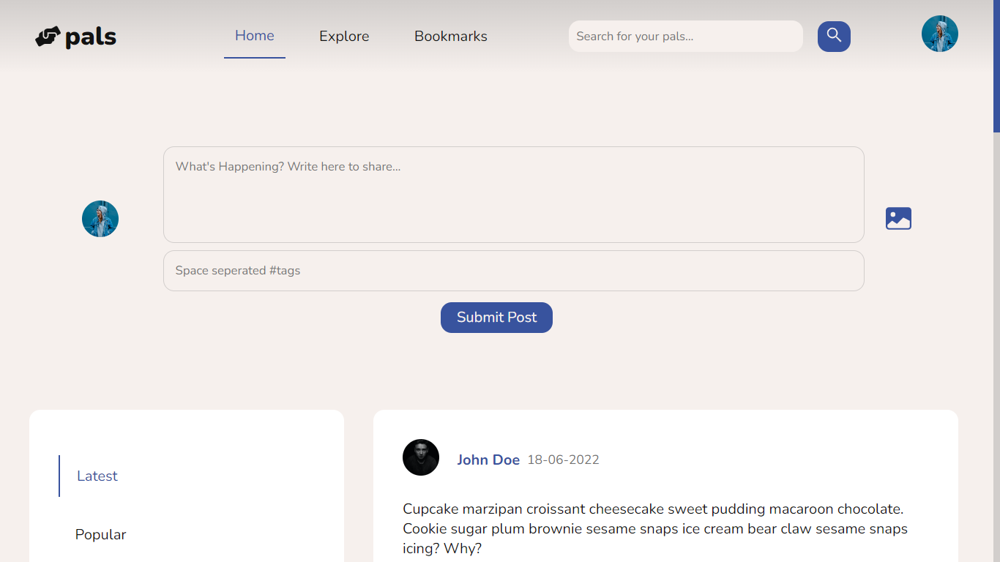
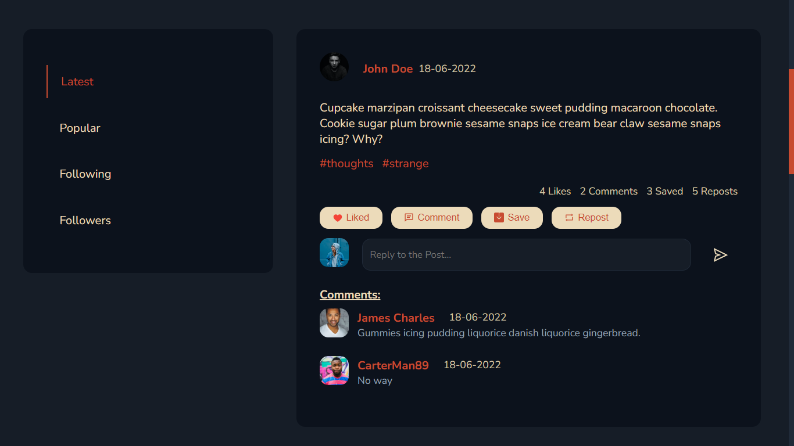

# pals - Social Media Application

-   This is a complete full-stack social media web-application developed using the MERN stack.

## Screenshots:

-   User Profile Themes.
    
    
     

-   Profile page filters, recommendations, and posts.
    
     

-   Upload posts from the Home page.
    
     

-   Interact with posts with Likes and Comments.
    

## Features:

-   This social media application includes various commonly-used social media functionality such as:
    -   Login, Register, and Logout.
    -   Sharing Posts and Images.
    -   Liking and Commenting on Posts and using Hashtags to group posts.
    -   Refine posts on the page using different filters, such as filter posts by popularity, filter by hashtags, filter posts to only see those by people that I follow, filter posts that only have media, filter posts that I have replied to, etc.
    -   Following and Unfollowing users.
    -   Searching for users.
    -   Light and Dark themes.
    -   And more.

## Frameworks and Libraries Used:

-   Front-end: React JS, Vanilla CSS, HTML, JS
-   Back-end: Express JS, Node JS, JSON Web Tokens, MongoDB

## Setup:

-   Open a terminal window and enter `cd server` and then `npm i` which will install all the dependencies required to run the back-end server.
-   Then, run `npm start` to run the server.
-   Open another terminal window and enter `cd client` and then `npm i` to install all the front-end dependencies required to run the React Application.
-   Run `npm start` to start the client-side application.
-   Make sure you have the MongoDB server running in the background to connect to the Database.

## License

MIT License

Copyright (c) [2022] [Sonu Bardai]

Permission is hereby granted, free of charge, to any person obtaining a copy
of this software and associated documentation files (the "Software"), to deal
in the Software without restriction, including without limitation the rights
to use, copy, modify, merge, publish, distribute, sublicense, and/or sell
copies of the Software, and to permit persons to whom the Software is
furnished to do so, subject to the following conditions:

The above copyright notice and this permission notice shall be included in all
copies or substantial portions of the Software.

THE SOFTWARE IS PROVIDED "AS IS", WITHOUT WARRANTY OF ANY KIND, EXPRESS OR
IMPLIED, INCLUDING BUT NOT LIMITED TO THE WARRANTIES OF MERCHANTABILITY,
FITNESS FOR A PARTICULAR PURPOSE AND NONINFRINGEMENT. IN NO EVENT SHALL THE
AUTHORS OR COPYRIGHT HOLDERS BE LIABLE FOR ANY CLAIM, DAMAGES OR OTHER
LIABILITY, WHETHER IN AN ACTION OF CONTRACT, TORT OR OTHERWISE, ARISING FROM,
OUT OF OR IN CONNECTION WITH THE SOFTWARE OR THE USE OR OTHER DEALINGS IN THE
SOFTWARE.
